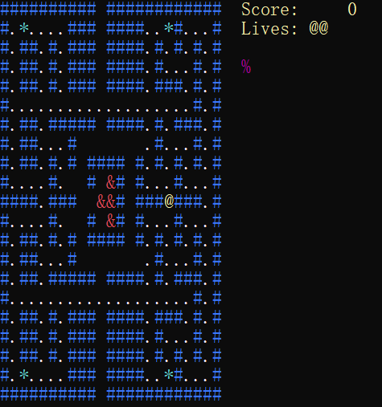

# Terminal Pac-Man Game in VB.NET

## Overview

This is a simple implementation of the classic Pac-Man game, designed to run in a terminal environment using VB.NET. The game features basic gameplay mechanics, including player movement, enemy AI, power pellets, and level progression. It is intended for educational purposes and as a fun project for developers interested in game development with VB.NET.



## Features

- **Classic Gameplay**: Navigate through a maze, collect pellets, and avoid ghosts.
- **Power Pellets**: Temporarily turn the tables on the ghosts.
- **Level Progression**: Multiple levels with increasing difficulty.
- **Terminal-Based Graphics**: Simple text-based interface for easy accessibility.
- **Enemy AI**: Basic pathfinding for ghost movement using A* algorithm.
- **Score Tracking**: Keep track of your score and lives.

## Getting Started

### Prerequisites
- **.NET SDK 8.0**: Ensure you have the .NET SDK 8.0 installed on your system (.NET Framework might be optional but is recommended).
- **VB.NET Compiler**: You can use Visual Studio or any other VB.NET compiler to run this project.

### Installation
- Clone the repository:
``` bash
git clone https://github.com/Pac-Dessert1436/Terminal-PAC-MAN-Game.git
```
- Navigate to the project directory:
``` bash
cd Terminal-PAC-MAN-Game
``` 
- Open the project in Visual Studio or your preferred IDE.

- Compile and run the project.

## Controls

- **Arrow Keys**: Move Pac-Man up, down, left, and right.
- **Enter Key**: Start the game from the title screen.

## Gameplay Mechanics

### Player
- The player controls Pac-Man, represented by the `@` symbol.
- Collect pellets (`.`) and power pellets (`*`) to increase your score.
- Avoid ghosts represented by the `&` symbol.

### Ghosts
- Ghosts move around the maze using a basic A* pathfinding algorithm. The algorithm is somewhat inaccurate for the moment, and therefore needs future improvements. 
- When a power pellet is eaten, ghosts turn scared (represented by a cyan `&`) and can be eaten for bonus points.

### Scoring
- **Pellets**: 10 points each.
- **Power Pellets**: 50 points each.
- **Ghosts (when scared)**: 200 points for the first, double for the subsequent.
- **Cherries**: 100 points at the first level, 300 points for the second, and so forth.

### Levels
- Complete levels by clearing all pellets.
- The game progresses through multiple levels with increasing difficulty.
- The game ends after Level 7 is completed.

### Lives
- The player starts with 3 lives.
- An extra life is awarded at 10,000 points.

### Code Structure
- **`Program` Module**: Contains the main game loop, player logic, and enemy logic.
- **`GridIndex` Structure**: Represents coordinates in the game grid.
- **`AStarAlgorithm` Class**: Implements the A* pathfinding algorithm for ghost movement.
- **Game Map**: A 2D array representing the maze layout.

### Contributing
Contributions are welcome! If you have any ideas for new features, improvements, or bug fixes, please feel free to open an issue or submit a pull request.

### License
This project is licensed under the MIT License. See the LICENSE file for details.